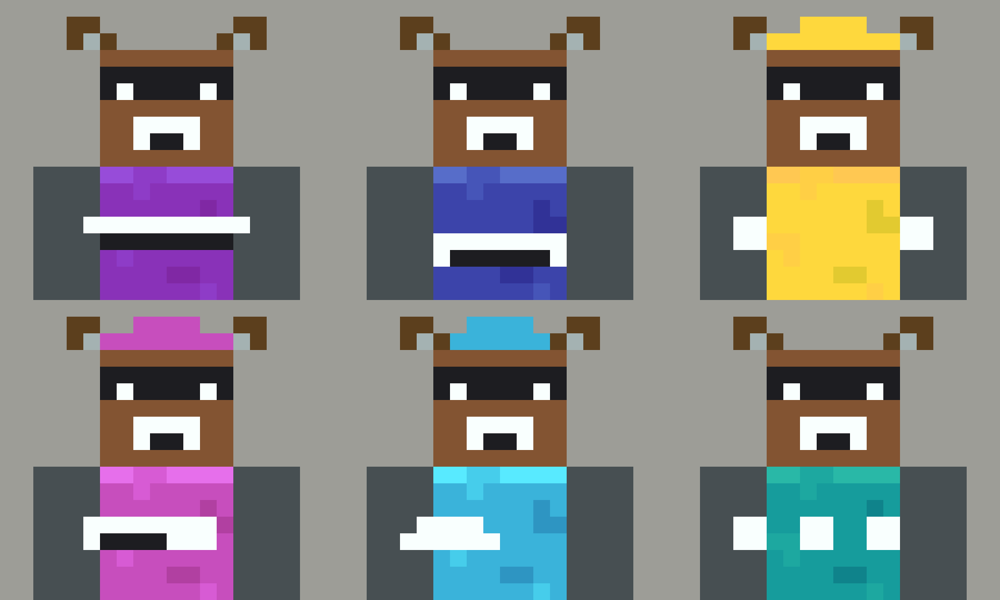
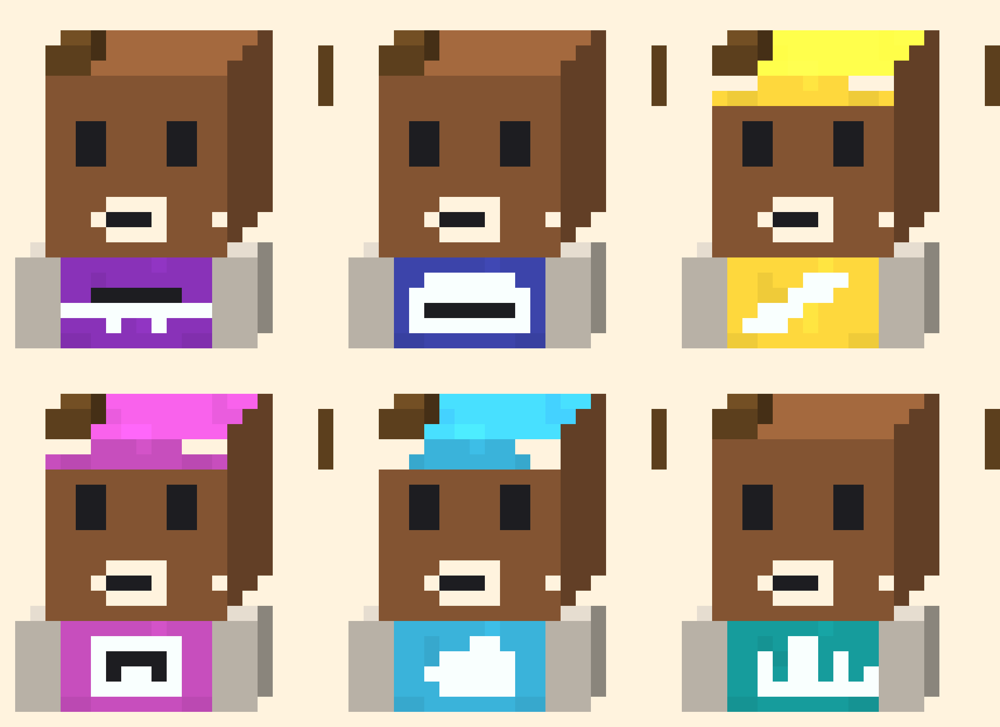

# blockcrew

**Blocky voxel character avatars for a fleet of AI agents — one little person
per role, built as a matching set.**

An Agent Skill. Point it at your agents, get back a crew that looks like a
family and never gets confused in a sidebar.

```
npx skills@latest add ANQIcai/blockcrew
```

Then ask your agent:

> give my agents avatars with blockcrew

Or run the renderer directly — no API key, no network, no image model:

```sh
python3 scripts/render.py --roster my-crew.json --out avatars/
```


**Start from a photo** — yourself, a character, a mascot — and the crew becomes
variations of that base:

```sh
python3 scripts/render.py --base me.jpg --roster my-crew.json --out avatars/
```

It samples skin, hair, clothing and background, snaps each to the nearest
palette slot, and prints what it chose so you can override any of them.

> ⚠️ Colours transfer. Faces do not. At eight texels across a head face an eye
> is one texel — there is no likeness available at this resolution, and the
> skill says so rather than pretending otherwise.

**Every quantity in this skill is a number** — head 8×8×8, torso 8×12×4, eight
texels per head face, sixteen hex values, fixed crop, fixed angle. That is a
rendering problem, not a generation problem, so the default method constructs
the pixels instead of asking a model to approximate them.

> Consistency stops being something you verify and becomes something you
> cannot violate.

---

## A crew does not have to be human

Swap the head, keep every other rule. The shared-slot architecture is
species-agnostic — same geometry, same ramps, same one-prop rule.

```sh
python3 scripts/render.py --species raccoon \
    --fur brown --muzzle white --mask black --background light_gray \
    --roster my-crew.json --out avatars/
```

**Raccoon crew** — the mask is the identity, and the ears break the square
skull so it still survives the silhouette test:



**Cat crew** — same six roles, same props, different species:



Built in: `human` (default), `raccoon`, `cat`, `fox`, `bear`. Adding one is a
single 20×8 text block in `SPECIES_HEADS` — which is the point of a sprite
table over a prompt.

### 🔴 Two contrast pairs, not one

Species crews fail in a way human ones don't, and the renderer now checks for
it. Measured across three renders (luminance difference, 0–255):

| fur / background | fur–bg | mask–fur | mask–bg | result |
|---|---|---|---|---|
| light grey on grey | 79 | 127 | 48 | washed out |
| light grey on black | 127 | 127 | 0 | mask lost |
| brown on light grey | 65 | 62 | **127** | reads |

⭐ **The combination that works has the LOWEST fur-vs-background contrast of
the three.** The first check written here tested exactly that pair, passed
every failing case, and was therefore decoration rather than a gate.

The pairs that actually decide it:

1. **mask vs background** — the mask band spans the full head width, so it
   touches the silhouette edge. Match the background and the outline breaks
   there; the face detaches from the skull.
2. **mask vs fur, as a band not a floor** — too little and the marking
   vanishes, too much and the mask reads as the whole head instead of a
   stripe across it. Both failures measured 127; the one that reads is 62.

`check_species_contrast()` is verified against those three cases plus a human
control: it must fire on the two known failures and stay silent on the two
known-good ones.

### ⚠️ On licensed characters

This skill will not reproduce a named character from an existing franchise.
Style is not protectable; specific characters are, and the ones people ask
for are usually owned by companies whose business *is* licensing.

**What it does instead:** the generic animal, the palette, the shape language
— from which you can build something that is yours to publish.

---

## Why a crew, not a mascot

Most avatar generators make **one** character. That is a different, easier
problem.

A fleet of agents shows up **side by side** — in a sidebar, a config file, a
dashboard row — usually at 32–64 pixels. The set has to answer two questions
at the same time:

| Question | Solved by |
|---|---|
| Are these the same team? | Shared geometry, shared neutral colour, shared view angle |
| Which one is the trading agent? | Silhouette first, colour second |

Optimise only for the first and you get six characters nobody can tell apart.
Optimise only for the second and you get six characters that look like they
came from six different projects.

**blockcrew is the constraint set that holds both.**

---

## What it produces

One square image per agent: a blocky humanoid **bust** — head, torso and arms,
cropped at the chest like a profile picture. Cube head, prism torso, two square
eyes. Hard 90° edges, no curves, no legs.

**Low-resolution on purpose, to an exact spec.** Classic voxel-character
proportions in texels — head `8×8×8`, torso `8×12×4`, arms `4×12×4` — with
**8 texels per head face**, flat per-face shading, and hard nearest-neighbour
edges. No anti-aliasing, no gradients, no gloss: a diagonal is a visible
staircase of squares.

> The head is **exactly as wide as the torso**. That one proportion is what
> separates a voxel character from a generic blocky figure — and it is the
> first thing an image model gets wrong if you don't say it.

Each one names its job three ways: **headwear, outfit block, and one oversized
prop.**

| Role | Headwear | Prop | Hue |
|---|---|---|---|
| Career / job search | neat side-part | briefcase | indigo |
| Trading / investment | headset | candlestick bar | teal |
| Admin / butler | slicked flat hair | serving tray | warm grey |
| Building / engineering | hard hat | wrench | amber |
| Content / filming | backwards cap | boxy camera | magenta |
| Marketing | beret | megaphone | cyan |

⚠️ **That table is an example, not the menu.** Your fleet is whatever agents
*you* run — support, legal, scheduling, a game master, a household bot. The
skill derives a kit for each of your roles from three questions: what does this
person carry, what do they wear on their head, what colour says the uniform.

🔴 **Headwear matters more than the prop.** At 32px the prop becomes a smudge
and the outline of the head is still legible — so where two roles hold similar
tools, the hat is what separates them.

---

## The rules that do the work

**Five to six materials per avatar** — skin, hair, chest, sleeves, prop,
optional accent. Each rendered in two to four quantised shades on the texel
grid.

**Hue-shifted ramps, not flat fills.** Shadows shift toward blue and gain
saturation; highlights shift toward yellow and lose it. Entities are lit
top-and-front, and an edge is the shadow shade of its own material — never a
black outline, which is an item-sprite convention that looks wrong on a
character.

> A straight ramp varies only brightness, and the style guide calls those
> dull. This is why a technically-correct palette can still look flat.

**A locked 16-colour palette.** Every value is a named slot with a hex code —
greys and browns reserved for the shared slots, eleven high-chroma slots
available as role hues. Each material uses its base value plus the palette's
own darker variant for faces turned from the light, so shading is a lookup
rather than a judgement.

> "Pick hues far apart on the wheel" is vague. "Pick two of sixteen named
> slots" is checkable — and it removes the commonest source of drift: six
> generations each inventing a slightly different teal.

**Coherence comes from the shared slots, not from scarcity.** Skin, background
and the sleeves are identical across the whole crew; everything else
varies freely. One dominant role hue per agent, with every other per-agent
colour lower in saturation so the hue still reads.

**Exactly one prop.** Not two. A second prop reads as clutter at avatar size
and destroys the silhouette.

**One camera angle, pinned.** Straight-on, or turned 10–15° to the viewer's
right — chosen once for the whole crew, never per avatar. Eyes meet the viewer
either way.

**An invariant block, pasted verbatim into every generation.** Camera, crop
height, texel size, light direction, skin, sleeves, background. Independent
generations drift; identical text is the only thing that stops them.

> Consistency is not a quality to aim for. It is text that must be identical.

**The silhouette test.** Before delivery, every member is checked as a flat
black shape at 32×32. If two are confusable, the fix is a different
*silhouette*, never a different shade.

> Colour identifies fastest. Silhouette identifies reliably — it survives
> greyscale, dark mode, colourblindness, and a compressed thumbnail.

**No red-versus-green** as the only separator between two agents. Roughly 1 in
12 men cannot distinguish them, and a sidebar is exactly where that fails.

---

## Requirements

A capable image model — GPT Image 2, Nano Banana Pro, Seedance Pro, or
equivalent. The skill will ask you to enable one rather than silently falling
back to something worse.

Works with any agent that reads Agent Skills.

---

## ⚖️ On style and names

This skill generates a **generic blocky aesthetic**. It will not reproduce
characters, mobs, skins, or logos from any existing game or franchise, and it
will decline to name outputs after them.

Style is not protectable under copyright; specific characters and names are.
Borrow the aesthetic, never the vocabulary.

---

## Licence

MIT. Do what you like with it.## Real 3D Rendering — The Vanilla Game Look

🔴 **A flat sprite never looked right.** The previous output had horizontal
banding — `AAAAAAAA / BBBBBBBB / CCCCCCCC` rows on the torso — the style
guide's *"pixels lined up brightest to darkest in straight lines, reveals the
pixel grid, misrepresents the shape."*

The problem was not palette correctness. A vanilla character is **six boxes
seen at an angle**, and the renderers people recognise all draw those boxes
the same way.

### Real Model Dimensions

| part | w × h × d |
|------|-----------|
| head | 12 × 12 × 12 — a cube, 12 to fit the measured 12×12 face |
| overlay | 13 × 13 × 13 — the head inflated 0.5 texel each side |
| body | 10 × 9 × 6 (bust crop) |
| arms | 3 × 9 × 6 |

### Isometric Projection — the one the modder renderers use

🔴 **Cabinet oblique was the main defect.** Four iterations kept the front
face an exact rectangle "to keep the eyes crisp". That is generic pixel art.
Crafatar, Mineatar and NMSR all use the same three fixed 2×2 matrices (ported
verbatim from `mineatar-io/skin-render`, `matrix.go`):

```
side  = rotate(+30°) · skewX(+30°) · scaleY(0.86603)
front = rotate(−30°) · skewX(−30°) · scaleY(0.86603)
top   = rotate(+30°) · skewX(−30°) · scaleY(0.86603)
```

The front face comes out **sheared** — vertical edges stay vertical,
horizontal edges rise to the right at 1:2. ⭐ The shear is the signature, not
a cost. The camera looks from above, the front and the character's right, so
the darker side face is on the viewer's **left**, exactly as in Crafatar.

Sampling is nearest-neighbour: every output pixel takes exactly one texel
colour, no blending, no anti-aliasing. Faces are scaled first and transformed
second, so sloped edges step at one output pixel.

### No Brightness Multipliers

The skin renderers apply **no** per-face multipliers — they trust the
texture. The earlier 1.0 / 0.8 / 0.6 (and the rebased 1.25 / 1.0 / 0.75) were
the *block* renderer's constants, solving a problem the recognised renderers
never had. Shading now comes from the hue-shifted ramp per face:

```
top = HIGHLIGHT    front = MID    side = SHADOW
```

A texel that already carries its own step (an eye, a mouth, a material
cluster) keeps it on every face, as a painted texture would.

### Second Layer — the Overlay

The head is **two boxes**: the 12×12×12 base plus an overlay cube inflated by
0.5 texel on every side, transparent wherever there is no headwear. Hats and
hair are drawn on the overlay, so they sit **proud** of the skull instead of
being painted flat onto the face. This is the 64×64 skin's "hat" layer, which
every renderer composites.

### Head Is the Default

`--view head` (default) renders the isometric head with its overlay —
Crafatar's `/renders/head/` and NMSR's `/head/`, the unit people recognise.
`--view bust` adds a torso, two arms and the role prop (painted into the
torso's front texture, so it shears with the face).

### Ears Are Boxes, Not Texels

In a 3D model an ear is a separate cuboid with its own three faces. Species
ears are rendered as boxes standing on the head's top corners, shaded by the
same per-face ramp rule.

---


