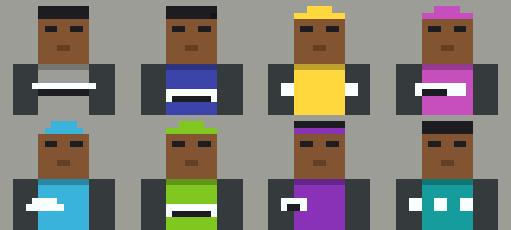

# blockcrew

**Blocky voxel character avatars for a fleet of AI agents — one little person
per role, built as a matching set.**

An Agent Skill. Point it at your agents, get back a crew that looks like a
family and never gets confused in a sidebar.

```
npx skills@latest add ANQIcai/blockcrew
```

Then ask your agent:

> give my agents avatars with blockcrew

Or run the renderer directly — no API key, no network, no image model:

```sh
python3 scripts/render.py --roster my-crew.json --out avatars/
```



**Start from a photo** — yourself, a character, a mascot — and the crew becomes
variations of that base:

```sh
python3 scripts/render.py --base me.jpg --roster my-crew.json --out avatars/
```

It samples skin, hair, clothing and background, snaps each to the nearest
palette slot, and prints what it chose so you can override any of them.

> ⚠️ Colours transfer. Faces do not. At eight texels across a head face an eye
> is one texel — there is no likeness available at this resolution, and the
> skill says so rather than pretending otherwise.

**Every quantity in this skill is a number** — head 8×8×8, torso 8×12×4, eight
texels per head face, sixteen hex values, fixed crop, fixed angle. That is a
rendering problem, not a generation problem, so the default method constructs
the pixels instead of asking a model to approximate them.

> Consistency stops being something you verify and becomes something you
> cannot violate.

---

## Why a crew, not a mascot

Most avatar generators make **one** character. That is a different, easier
problem.

A fleet of agents shows up **side by side** — in a sidebar, a config file, a
dashboard row — usually at 32–64 pixels. The set has to answer two questions
at the same time:

| Question | Solved by |
|---|---|
| Are these the same team? | Shared geometry, shared neutral colour, shared view angle |
| Which one is the trading agent? | Silhouette first, colour second |

Optimise only for the first and you get six characters nobody can tell apart.
Optimise only for the second and you get six characters that look like they
came from six different projects.

**blockcrew is the constraint set that holds both.**

---

## What it produces

One square image per agent: a blocky humanoid **bust** — head, torso and arms,
cropped at the chest like a profile picture. Cube head, prism torso, two square
eyes. Hard 90° edges, no curves, no legs.

**Low-resolution on purpose, to an exact spec.** Classic voxel-character
proportions in texels — head `8×8×8`, torso `8×12×4`, arms `4×12×4` — with
**8 texels per head face**, flat per-face shading, and hard nearest-neighbour
edges. No anti-aliasing, no gradients, no gloss: a diagonal is a visible
staircase of squares.

> The head is **exactly as wide as the torso**. That one proportion is what
> separates a voxel character from a generic blocky figure — and it is the
> first thing an image model gets wrong if you don't say it.

Each one names its job three ways: **headwear, outfit block, and one oversized
prop.**

| Role | Headwear | Prop | Hue |
|---|---|---|---|
| Career / job search | neat side-part | briefcase | indigo |
| Trading / investment | headset | candlestick bar | teal |
| Admin / butler | slicked flat hair | serving tray | warm grey |
| Building / engineering | hard hat | wrench | amber |
| Content / filming | backwards cap | boxy camera | magenta |
| Marketing | beret | megaphone | cyan |

⚠️ **That table is an example, not the menu.** Your fleet is whatever agents
*you* run — support, legal, scheduling, a game master, a household bot. The
skill derives a kit for each of your roles from three questions: what does this
person carry, what do they wear on their head, what colour says the uniform.

🔴 **Headwear matters more than the prop.** At 32px the prop becomes a smudge
and the outline of the head is still legible — so where two roles hold similar
tools, the hat is what separates them.

---

## The rules that do the work

**Five to six materials per avatar** — skin, hair, chest, sleeves, prop,
optional accent. Each rendered in two to four quantised shades on the texel
grid.

**A locked 16-colour palette.** Every value is a named slot with a hex code —
greys and browns reserved for the shared slots, eleven high-chroma slots
available as role hues. Each material uses its base value plus the palette's
own darker variant for faces turned from the light, so shading is a lookup
rather than a judgement.

> "Pick hues far apart on the wheel" is vague. "Pick two of sixteen named
> slots" is checkable — and it removes the commonest source of drift: six
> generations each inventing a slightly different teal.

**Coherence comes from the shared slots, not from scarcity.** Skin, background
and the sleeves are identical across the whole crew; everything else
varies freely. One dominant role hue per agent, with every other per-agent
colour lower in saturation so the hue still reads.

**Exactly one prop.** Not two. A second prop reads as clutter at avatar size
and destroys the silhouette.

**One camera angle, pinned.** Straight-on, or turned 10–15° to the viewer's
right — chosen once for the whole crew, never per avatar. Eyes meet the viewer
either way.

**An invariant block, pasted verbatim into every generation.** Camera, crop
height, texel size, light direction, skin, sleeves, background. Independent
generations drift; identical text is the only thing that stops them.

> Consistency is not a quality to aim for. It is text that must be identical.

**The silhouette test.** Before delivery, every member is checked as a flat
black shape at 32×32. If two are confusable, the fix is a different
*silhouette*, never a different shade.

> Colour identifies fastest. Silhouette identifies reliably — it survives
> greyscale, dark mode, colourblindness, and a compressed thumbnail.

**No red-versus-green** as the only separator between two agents. Roughly 1 in
12 men cannot distinguish them, and a sidebar is exactly where that fails.

---

## Requirements

A capable image model — GPT Image 2, Nano Banana Pro, Seedance Pro, or
equivalent. The skill will ask you to enable one rather than silently falling
back to something worse.

Works with any agent that reads Agent Skills.

---

## ⚖️ On style and names

This skill generates a **generic blocky aesthetic**. It will not reproduce
characters, mobs, skins, or logos from any existing game or franchise, and it
will decline to name outputs after them.

Style is not protectable under copyright; specific characters and names are.
Borrow the aesthetic, never the vocabulary.

---

## Licence

MIT. Do what you like with it.
